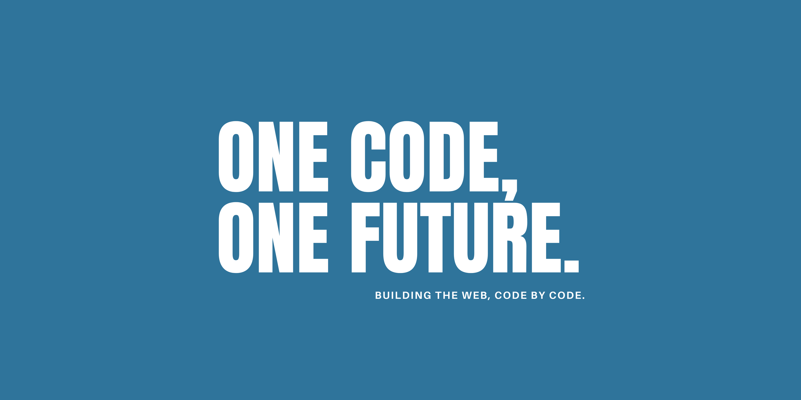

<!-- Banner -->

  

<!-- Introduction -->
<h2 align="center">Hello World 👋</h2>

<!-- About Me -->
<h1 align="center"><tt>About Me 🚀</tt></h1>

I'm a full stack developer with a fervent passion for technology. Proficient in both frontend and backend, I'm specialize in using HTML5, CSS3, JavaScript, Java, Spring, and SQL to create robust and performant web applications. I love crafting dynamic interfaces with React and managing application state with Redux. Beyond my job, I find inspiration in music and sports.

<!-- Skills -->
<h1 align="center"><tt>Skills 🛠️</tt></h1>

<!-- Frontend -->
<h3 align="center">Frontend Development</h3>

  
  
  
  
  
  
  
  

<!-- Backend -->
<h3 align="center">Backend Development</h3>

  
  
  
  

<!-- Editors -->
<h3 align="center">Editors</h3>

  
  

<!-- Contact -->
<h1 align="center"><tt>Contact 📞</tt></h1>

You can contact me via:

  
  

<!-- Footer -->

&copy; ReadMe.md By Liborio Daniele Frasca

